# Shopping Cart System

[](https://github.com/Shivasaireddy007/shopping_cart_system/actions/workflows/tests.yml)

An e-commerce backend built with Laravel 12 and MySQL: a versioned REST API for products,
cart and orders with JWT authentication, Razorpay payments, Shiprocket shipping,
Elasticsearch faceted search and Redis caching. A storefront and admin panel come from an
open-source e-commerce package; the API, payments, shipping, search and caching are my own code.

## Highlights

- **Catalog listing p95 cut from 277 ms to 10.8 ms** on a 100,000-product catalog at
  150 requests/second, through composite MySQL indexes and a Redis cache
  ([benchmark write-up](benchmarks/README.md))
- **No overselling:** checkout reserves stock inside a transaction with the product rows
  locked in id order, so concurrent checkouts can't sell the same last unit or deadlock
- **Payments recorded exactly once:** the checkout callback and Razorpay's webhook can report
  the same payment, and webhooks can be delivered more than once; HMAC signatures are verified
  and duplicates are ignored
- **Faceted search** on Elasticsearch, where each facet's counts ignore its own filter, with an
  automatic fallback to MySQL if Elasticsearch is down
- **100 automated tests** running on GitHub Actions against MySQL and Redis

## Planned UI

Design mockups of the storefront and admin frontend that will be built on this API.
These screens aren't in the repository yet; screenshots from the running app will replace them.

**Storefront**

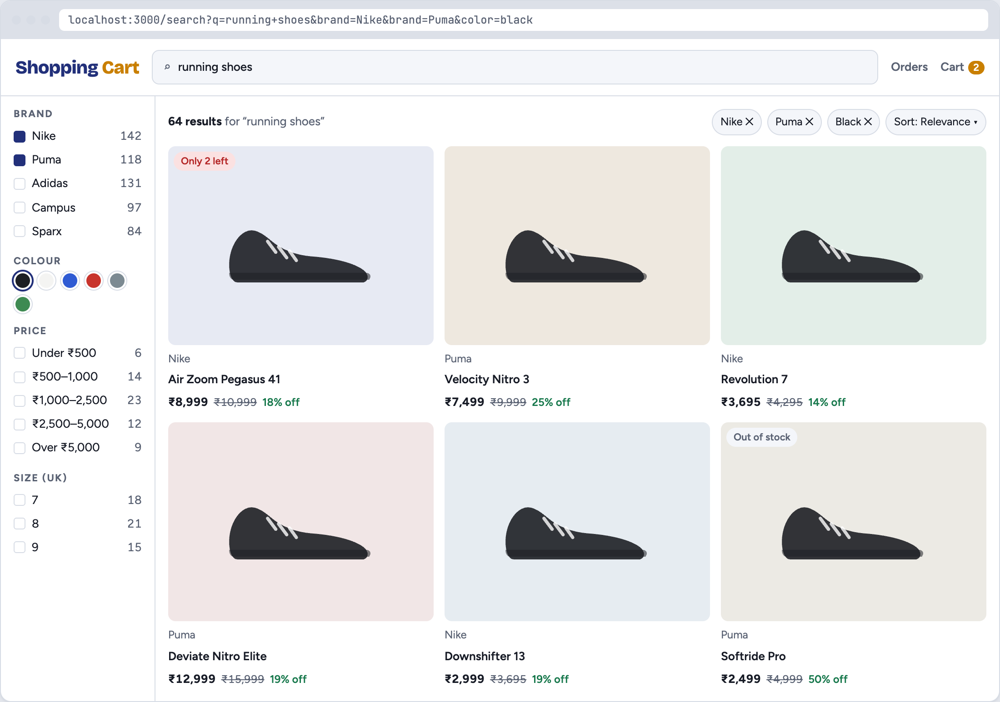

| Product page | Cart |
|---|---|
| 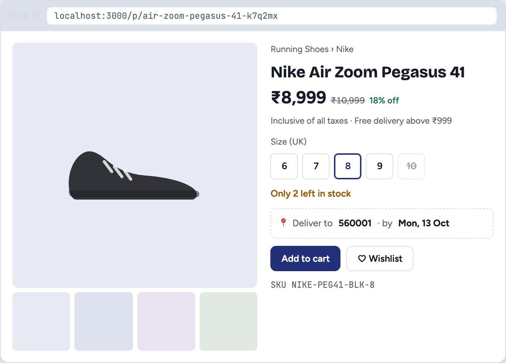 | 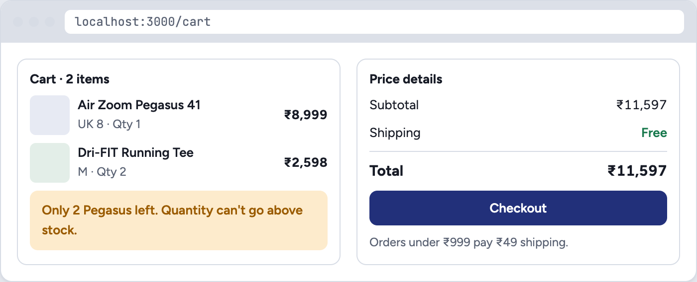 |

| Razorpay checkout | Order tracking |
|---|---|
| 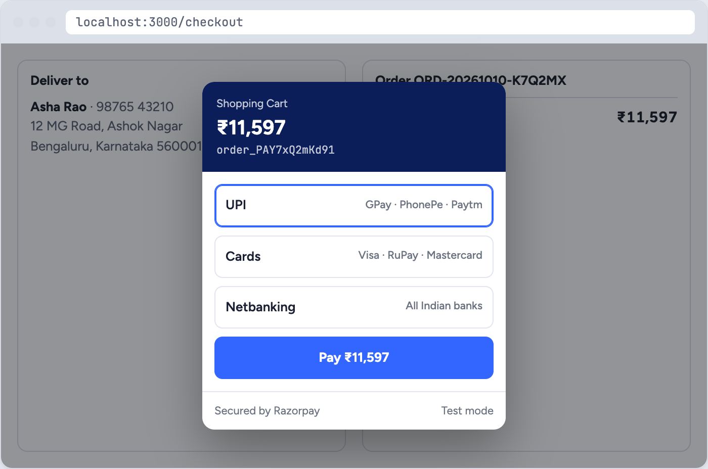 | 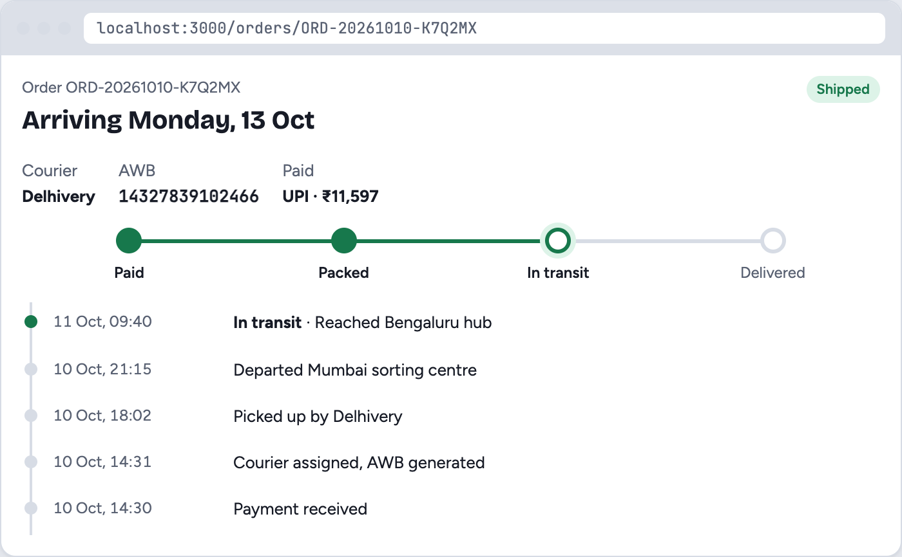 |

**Admin**

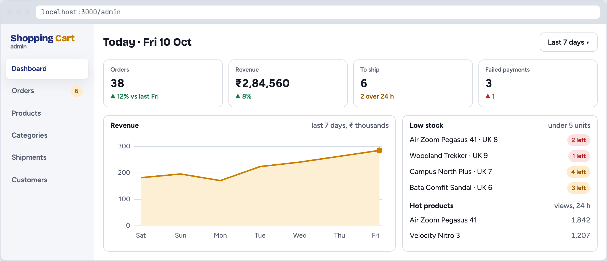

| Orders | Products |
|---|---|
| 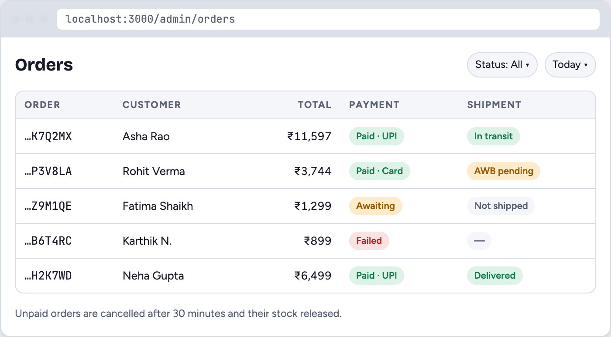 | 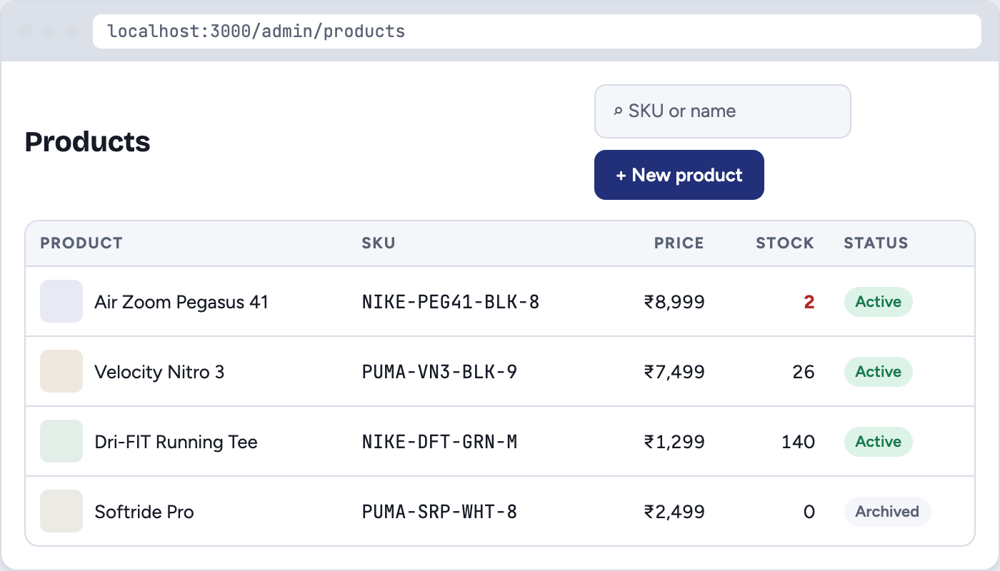 |

| Edit product | Shipments |
|---|---|
| 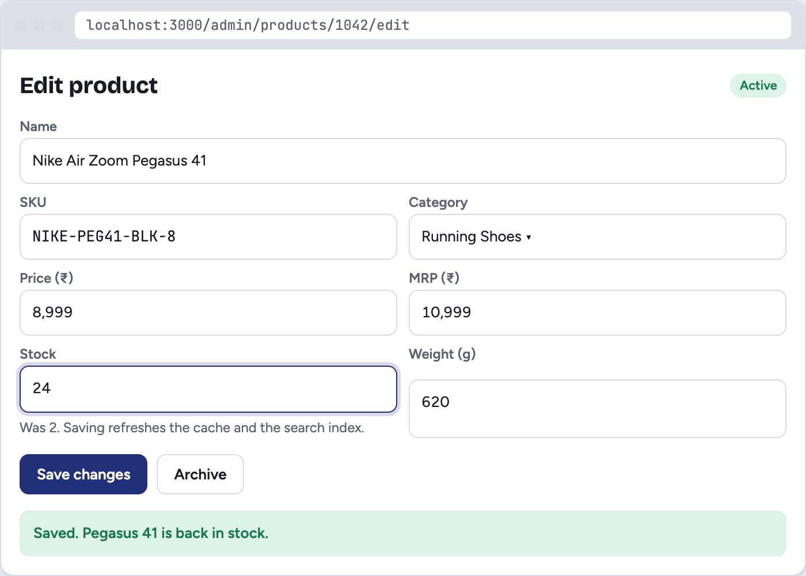 | 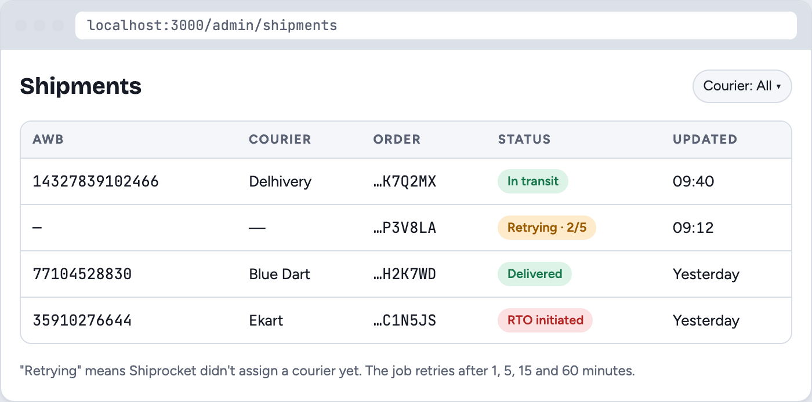 |

## Checkout and payment flow

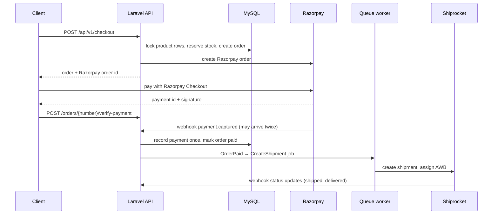

Orders left unpaid for 30 minutes are cancelled by a scheduled command, which puts the
reserved stock back.

## API

All endpoints are under `/api/v1`. Amounts are in paise (₹1 = 100 paise).

**Interactive docs:** with the app running, open [`/docs/api`](http://localhost:8000/docs/api) to browse
every endpoint, its parameters and response shapes, and send test requests with a JWT.
The OpenAPI 3.1 spec is committed at [`docs/openapi.json`](docs/openapi.json); import it into
Postman or Insomnia to get a ready-made collection. It is generated from the code with
`php artisan scramble:export --path=docs/openapi.json`, and CI fails if it is out of date.

| Method | Endpoint | Auth | Purpose |
|---|---|---|---|
| POST | `/auth/register`, `/auth/login` | – | Get a JWT |
| GET / POST | `/auth/me`, `/auth/refresh`, `/auth/logout` | JWT | Current user, refresh or revoke the token |
| GET | `/products` | – | Filter by category, brand, price, stock; sort; paginate (cached) |
| GET | `/products/{slug}` | – | Product details (cached, view counted) |
| GET | `/search` | – | Full-text search with brand, category, colour, size and price facets |
| GET | `/categories` | – | Category list |
| GET / DELETE | `/cart` | JWT | View or clear the cart |
| POST / PATCH / DELETE | `/cart/items[/{id}]` | JWT | Add, change quantity, remove (stock checked) |
| POST | `/checkout` | JWT | Create an order and a Razorpay order |
| GET | `/orders`, `/orders/{number}` | JWT | Order history and details |
| POST | `/orders/{number}/verify-payment` | JWT | Confirm a payment with the Razorpay signature |
| POST | `/orders/{number}/cancel` | JWT | Cancel an unpaid order and release its stock |
| GET | `/orders/{number}/tracking` | JWT | Courier and tracking timeline |
| GET / POST | `/admin/products` | Admin | List all products (incl. archived), create a product |
| PATCH / DELETE | `/admin/products/{id}` | Admin | Update price, stock or details; archive |
| POST / PATCH / DELETE | `/admin/categories[/{id}]` | Admin | Manage categories |
| POST | `/api/webhooks/razorpay` | Signature | Payment captured or failed |
| POST | `/api/webhooks/shiprocket` | Token | Shipment status updates |

## Tech stack

| Area | Tools |
|---|---|
| Backend | PHP 8.2+, Laravel 12 |
| Database | MySQL 8 |
| Auth | JWT (`php-open-source-saver/jwt-auth`) |
| Cache, sessions, queues | Redis |
| Search | Elasticsearch 8 |
| Payments, shipping | Razorpay, Shiprocket |
| Testing | PHPUnit, GitHub Actions, k6 for load tests |
| DevOps | Docker, Docker Compose |

## Code layout

| Path | What's there |
|---|---|
| `app/Http/Controllers/Api/V1` | API controllers |
| `app/Http/Controllers/Webhooks` | Razorpay and Shiprocket webhooks |
| `app/Services/Cart`, `Orders`, `Payments` | Cart, checkout with stock reservation, cancellation, payment recording |
| `app/Services/Shipping` | Shiprocket client and status updates |
| `app/Services/Search` | Elasticsearch client, index management, faceted search |
| `app/Services/Catalog` | Catalog queries, Redis cache, hot product tracking |
| `app/Jobs` | Queued shipment creation and search index sync |
| `tests/Feature/Api`, `tests/Unit` | API and unit tests |
| `benchmarks/` | k6 load test, results and write-up |

## Running locally

You need PHP 8.2+ (with `intl`), [Composer](https://getcomposer.org) 2.2+, Node.js,
MySQL 8, Redis and Elasticsearch 8.

```bash
git clone https://github.com/Shivasaireddy007/shopping_cart_system.git
cd shopping_cart_system
composer install
npm install && npm run build

cp .env.example .env          # then set DB_*, RAZORPAY_*, SHIPROCKET_* values
php artisan key:generate
php artisan jwt:secret
php artisan migrate
```

Then run the shop package's setup command to create its tables, listed under its section
in `php artisan list`.

Load some products and build the search index:

```bash
SEED_PRODUCTS=1000 php -d memory_limit=1G artisan db:seed --class=CatalogSeeder
php artisan search:reindex
```

Give a registered user admin rights for the `/admin` endpoints:

```bash
php artisan users:make-admin you@example.com
```

Start the app, a queue worker and the scheduler:

```bash
php artisan serve
php artisan queue:work
php artisan schedule:work
```

## Running with Docker

After `composer install`, start the app with MySQL, Redis, Elasticsearch, MinIO and Mailpit:

```bash
./vendor/bin/sail up -d
```

Inside Docker, set `DB_HOST=mysql`, `REDIS_HOST=redis` and
`ELASTICSEARCH_HOST=http://elasticsearch:9200` in `.env`. Emails appear in Mailpit at
[http://localhost:8025](http://localhost:8025).

## Tests

```bash
php artisan test
```

The tests need MySQL and Redis. Razorpay, Shiprocket and Elasticsearch are faked, and any
real outgoing HTTP request fails the test.

## Configuration

| Setting | Purpose |
|---|---|
| `JWT_SECRET`, `JWT_TTL` | Token signing key and lifetime in minutes |
| `RAZORPAY_KEY_ID`, `RAZORPAY_KEY_SECRET`, `RAZORPAY_WEBHOOK_SECRET` | Razorpay API and webhook verification |
| `SHIPROCKET_EMAIL`, `SHIPROCKET_PASSWORD`, `SHIPROCKET_PICKUP_LOCATION`, `SHIPROCKET_WEBHOOK_TOKEN` | Shiprocket API and webhook verification |
| `ELASTICSEARCH_ENABLED`, `ELASTICSEARCH_HOST`, `ELASTICSEARCH_INDEX` | Search |
| `CATALOG_CACHE_ENABLED` | Turn the Redis catalog cache on or off |
| `SHIPPING_FLAT_FEE`, `SHIPPING_FREE_ABOVE` | Shipping charges in paise |
| `API_RATE_LIMIT` | API requests per minute per user or IP |

## What I learned

- Preventing overselling with row locks, and ordering the locks to avoid deadlocks
- Making payment handling idempotent when callbacks and webhooks can repeat or arrive out of order
- Verifying webhook signatures with HMAC and constant-time comparison
- Building disjunctive facets with Elasticsearch `post_filter` and per-facet aggregations
- Reading `EXPLAIN` output and designing composite indexes for sorted, paginated queries
- Cache invalidation with versioned keys, and why it has to happen after the transaction commits
- Measuring performance with a reproducible load test instead of guessing
