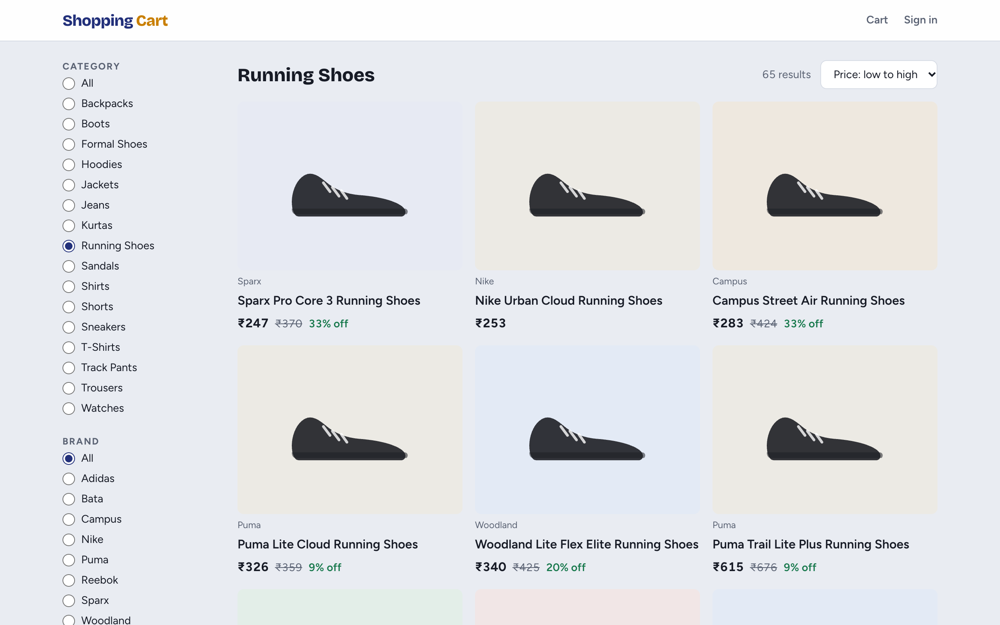
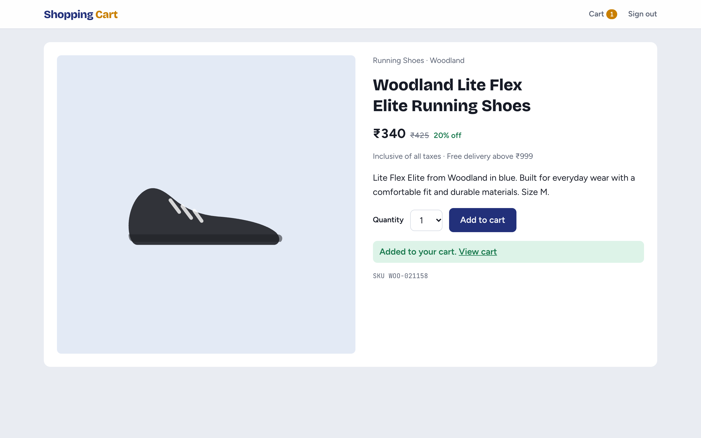
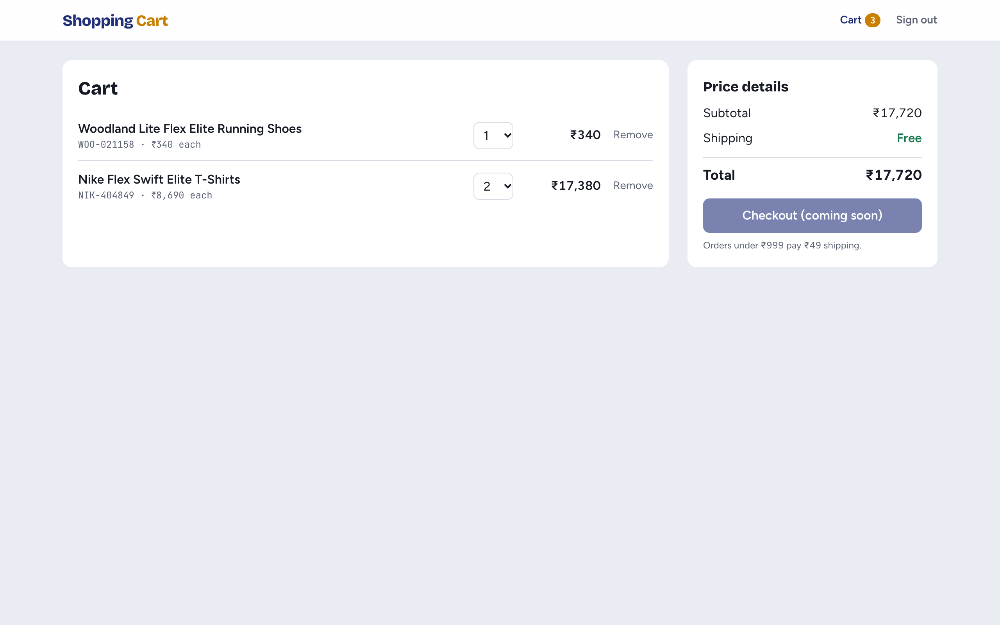
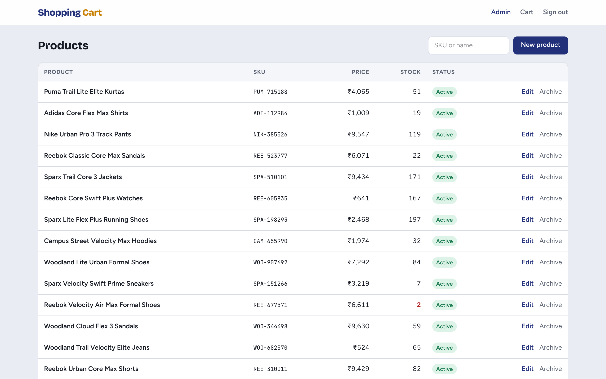
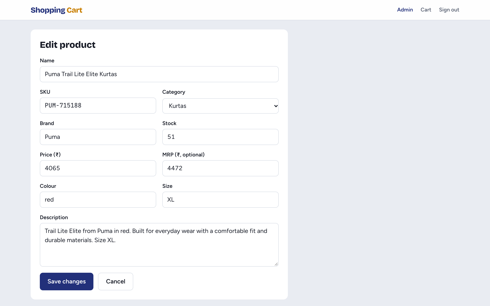

# Shopping Cart

[](https://github.com/Shivasaireddy007/shopping_cart_system/actions/workflows/ci.yml)

A full-stack e-commerce app: a **React + TypeScript** storefront and admin panel on a
**FastAPI** backend with **PostgreSQL**. Prices are in rupees, with Razorpay payments and
Shiprocket shipping on the roadmap.



| Product page | Cart |
|---|---|
|  |  |

| Admin: products | Admin: edit product |
|---|---|
|  |  |

## Status

The project is built in stages. Each stage is complete and tested before the next starts.

| Stage | Scope | Status |
|---|---|---|
| 1 | Catalog, cart, JWT auth, admin products, React storefront and admin, CI | ✅ Done |
| 2 | Checkout with row-locked stock reservation, Razorpay payments and signed webhooks | Next |
| 3 | Redis caching for hot products, OpenSearch faceted search | Planned |
| 4 | Kafka order events with the transactional outbox pattern, Shiprocket shipping | Planned |
| 5 | Docker and Kubernetes (Helm), observability, k6 load tests, live demo | Planned |

## Tech stack

| Layer | Tools |
|---|---|
| Frontend | React 19, TypeScript, Vite, React Router, TanStack Query, Zustand, React Hook Form + Zod, Tailwind CSS |
| Backend | FastAPI, Pydantic v2, SQLAlchemy 2 (async), Alembic |
| Database | PostgreSQL 17 |
| Auth | JWT access and refresh tokens, Argon2 password hashing, admin role |
| Quality | pytest, Vitest + Testing Library, ruff, mypy (strict), oxlint, GitHub Actions |
| Planned | Redis, OpenSearch, Kafka, Razorpay, Shiprocket, Docker, Kubernetes, Playwright, k6 |

## Design decisions

- **End-to-end types.** The backend's OpenAPI spec ([`docs/openapi.json`](docs/openapi.json)) generates
  the frontend's API types. If a backend field changes, the frontend stops compiling, and CI fails if
  either side is out of date.
- **Money as integers.** Amounts are stored and sent in paise (₹1 = 100 paise), so there are no
  floating-point rounding errors; the UI formats them with Indian digit grouping (₹1,09,999).
- **Rules enforced by the database too.** CHECK constraints stop negative stock, non-positive prices and
  an MRP below the price, even if application code has a bug.
- **No hidden queries.** Relationships are `lazy="raise"`, so an accidental lazy load raises an error
  instead of silently running N+1 queries; data is loaded explicitly with `selectinload`.
- **Indexes that match the sorts.** Composite indexes on `(is_active, price, id)`, `(is_active, name, id)`
  and `(is_active, category_id, price)` let paginated listings read in index order. The `id` tiebreaker
  follows the main sort direction so the index can serve it.
- **Short-lived tokens.** Access tokens last 15 minutes; the frontend swaps the refresh token for a new
  pair on a 401, and concurrent requests share a single refresh.
- **Fast, isolated tests.** Each backend test runs in a transaction that is rolled back afterwards, with
  the app's own commits turned into savepoints; the suite runs in under a second.

## API

| Method | Endpoint | Auth | Purpose |
|---|---|---|---|
| POST | `/api/v1/auth/register`, `/auth/login`, `/auth/refresh` | – | Get a token pair |
| GET | `/api/v1/auth/me` | JWT | Current user |
| GET | `/api/v1/categories` | – | Category list |
| GET | `/api/v1/products` | – | Filter by category, brand, price and stock; sort; paginate |
| GET | `/api/v1/products/{slug}` | – | Product details |
| GET / DELETE | `/api/v1/cart` | JWT | View or empty the cart |
| POST / PATCH / DELETE | `/api/v1/cart/items[/{id}]` | JWT | Add (stock checked, `409` if short), change quantity, remove |
| GET / POST | `/api/v1/admin/products` | Admin | List all products (incl. archived), create |
| PATCH / DELETE | `/api/v1/admin/products/{id}` | Admin | Update price, stock or details; archive |
| POST / DELETE | `/api/v1/admin/categories[/{id}]` | Admin | Manage categories |

With the backend running, interactive docs are at [`/docs`](http://127.0.0.1:8000/docs).

## Running locally

You need Python 3.12 with [uv](https://docs.astral.sh/uv/), Node.js 22+ and PostgreSQL.

```bash
# Backend: http://127.0.0.1:8000
cd backend
uv sync
createdb shop
uv run alembic upgrade head
uv run python -m app.seed --products 1000
uv run uvicorn app.main:app --reload
```

```bash
# Frontend: http://localhost:5173 (proxies /api to the backend)
cd frontend
npm ci
npm run dev
```

Demo logins: `demo@example.com` (customer) and `admin@example.com` (admin), password `demo-password`.

## Tests and checks

```bash
cd backend && createdb shop_test && uv run pytest && uv run ruff check . && uv run mypy app
cd frontend && npm test && npm run typecheck && npm run lint
```

After changing the API, regenerate the spec and the frontend types:

```bash
cd backend && uv run python -m app.export_openapi ../docs/openapi.json
cd frontend && npm run api:types
```

## Planned screens

Design mockups for the stages still to come. They'll be replaced with screenshots once built.

| Faceted search (stage 3) | Razorpay checkout (stage 2) |
|---|---|
|  |  |

| Order tracking (stage 4) | Admin dashboard |
|---|---|
|  |  |

| Admin orders | Admin shipments |
|---|---|
|  |  |

## License

[MIT](LICENSE)
